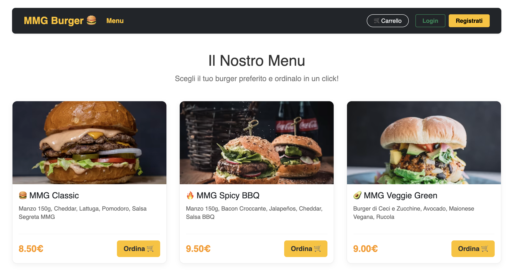
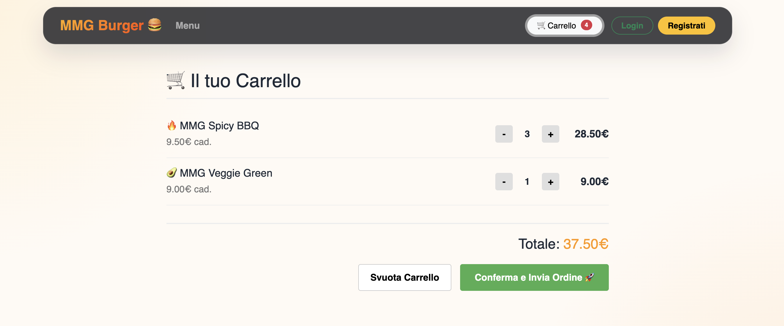

# 🍔 MMG Burger

<div align="center">


</div>

MMG Burger is a full-stack burger ordering platform built with React, Express and MongoDB. Users can browse the menu, add products to the cart, place orders and check their personal order history, while staff and administrators manage the kitchen workflow and order monitoring.

## 📸 Screenshots




---

## ✨ Overview

This project simulates a modern food-ordering application with a client-facing interface and an operational backend.

The app includes:

- user registration and login
- JWT-based authentication
- role-based access for customers, staff and admin users
- cart management with product quantity controls
- order creation and tracking
- dashboard views for the operating team

---

## 🚀 Features

### Customer features

- browse the burger menu
- add/remove items from the cart
- change item quantity before checkout
- place an order
- view personal order history

### Staff features

- staff dashboard for incoming orders
- order status management during preparation
- workflow support for kitchen operations

### Admin features

- admin order overview
- protected areas for privileged users
- centralized order management

### Security and data layer

- MongoDB + Mongoose integration
- password hashing with bcryptjs
- JWT authentication for protected routes
- server-side validation on order and auth endpoints

---

## 🛠️ Tech Stack

| Layer          | Technologies                  |
| -------------- | ----------------------------- |
| Frontend       | React, Vite                   |
| Styling        | Bootstrap, custom CSS modules |
| Backend        | Express.js                    |
| Database       | MongoDB, Mongoose             |
| Authentication | JWT, bcryptjs                 |
| Testing        | Node.js built-in test runner  |

---

## 📁 Project Structure

```text
MMG Burger/
├── api/
│   ├── config/
│   ├── controllers/
│   ├── middleware/
│   ├── models/
│   ├── routes/
│   ├── index.js
│   ├── login.js
│   ├── register.js
│   └── .env.example
├── public/
│   ├── MMG_ScreenShot.png
│   ├── MMG_ScreenShot2.png
│   └── site.webmanifest
├── src/
│   ├── components/
│   ├── context/
│   ├── App.jsx
│   ├── main.jsx
│   └── ...
├── tests/
│   └── api-routes.test.js
├── .env
├── .env.example
├── .gitignore
├── index.html
├── package.json
├── package-lock.json
├── vite.config.js
├── vercel.json
├── README.md
```

### Main folders

- `src/` → frontend React application and UI components
- `api/` → backend routes, controllers, middleware, config and models
- `public/` → static assets and screenshots
- `tests/` → automated API verification tests

---

## ⚙️ Getting Started

### 1. Install dependencies

```bash
npm install
```

### 2. Configure environment variables

Create a `.env` file in the project root based on `.env.example`:

```env
MONGODB_URI=mongodb+srv://<username>:<password>@<cluster-url>/<database>?retryWrites=true&w=majority
JWT_SECRET=your_super_secret_key
PORT=3001
```

### 3. Start the API server

```bash
npm run api
```

### 4. Start the frontend development environment

```bash
npm run dev
```

### 5. Run tests

```bash
npm test
```

### 6. Build the production bundle

```bash
npm run build
```

---

## ✅ Verification

The current project has been validated with:

- `npm test -- --test-reporter=spec`
- `npm run build`

Both commands have passed successfully in the project state currently in use.

---

## 🌐 Deployment

This project is configured for deployment with Vercel and includes a Vercel configuration file in the root.

---

## 👨‍💻 Author

Built by **Giorgio Cangemi** as part of the [Start2Impact](https://www.start2impact.it/) Full Stack Developer path.

---

## 📬 Contact

- [LinkedIn](https://www.linkedin.com/in/giorgio-cangemi/)
- [Email](mailto:g.cangemi1997@gmail.com)

---

## 📄 License

This project is intended for educational and portfolio purposes.
